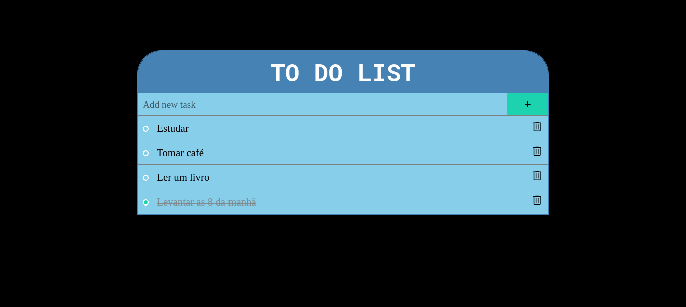

<h1 align='center'> To Do List</h1>

 
 

  
   <video src="github/to-do-list-gif.mp4" width="80%" controls autoplay></video>

# Índice

- [Descrição do Projeto](#descrição-do-projeto)
- [Tecnologias utilizadas](#tecnologias-utilizadas)
- [Autor](#author)

# Descrição do Projeto

Uma página simples de lista de tarefas que permite aos usuários adicionar, editar, marcar tarefa como concluída e excluir itens.
Usando o localStorage para armazenar os dados.

# Tecnologias utilizadas

- Javascript
- Git e Github

# Autor

 Paloma Santos Ferreira 
